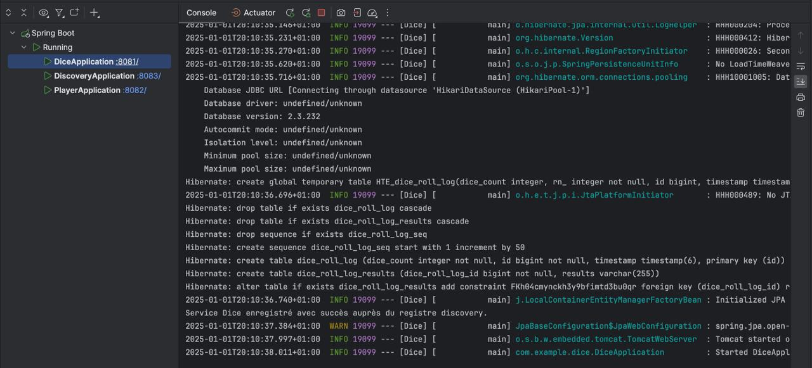
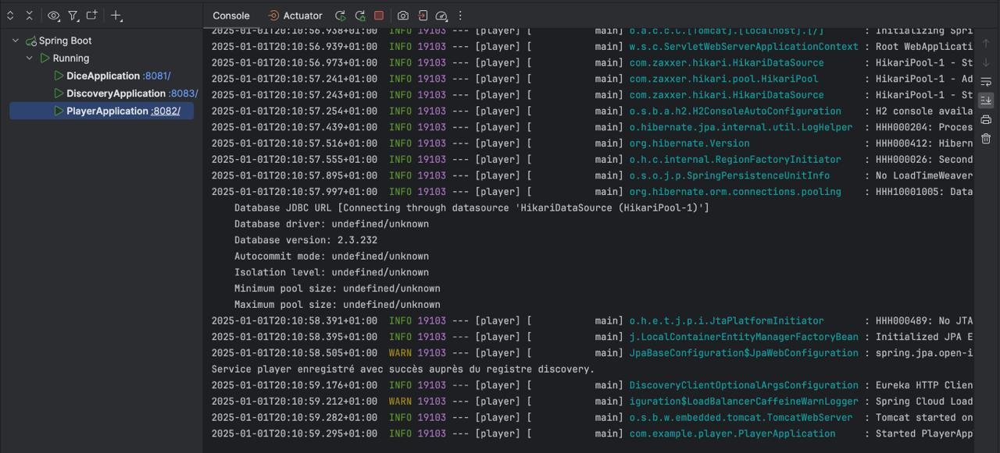
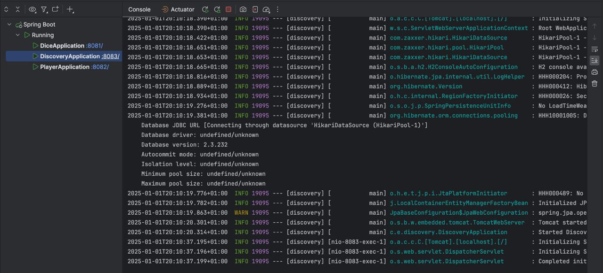
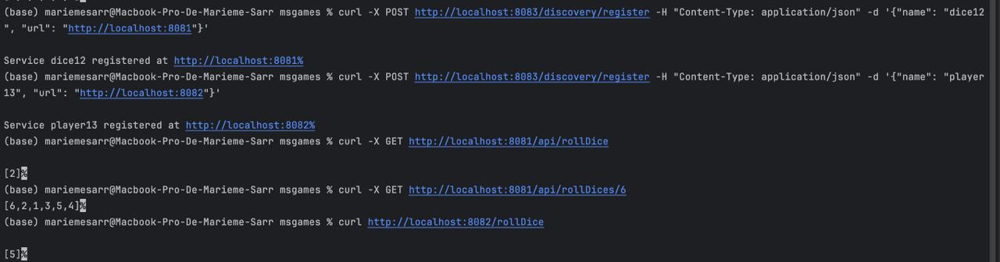

# Projet - Services Dice, Player, Discovery

Ce projet contient trois services :
- *Dice Service* : Gère le lancer de dés.
- *Player Service* : Gère les informations des joueurs.
- *Discovery Service* : Permet la découverte des services via un registre.

## Fonctionnement des Services

### Dice Service
- *Endpoints exposés* :
    - POST /roll : Lance un dé et retourne un résultat aléatoire.

- *Pour démarrer le service* :
    1. Allez au niveau des services, cliquez sur le service puis cliquez sur le bouton démarrer.

    2. Le service sera accessible à l'URL suivante : http://localhost:8081/.

- *Logs* :
    - Les logs du service afficheront des informations sur les lancés de dés, tels que les résultats.

### Player Service
- *Endpoints exposés* :
    - GET /players/{id} : Récupère les informations d'un joueur par son ID.
    - POST /players : Crée un nouveau joueur.

- *Pour démarrer le service* :
    1. Allez au niveau des services, cliquez sur le service puis cliquez sur le bouton démarrer.

    2. Le service sera accessible à l'URL suivante : http://localhost:8082/.

- *Logs* :
    - Les logs afficheront des informations concernant la création et la récupération des joueurs.

### Discovery Service
- *Endpoints exposés* :
    - GET /services : Liste tous les services enregistrés.
    - POST /register : Enregistre un service auprès du registre.

- *Pour démarrer le service* :
    1. Allez au niveau des services, cliquez sur le service puis cliquez sur le bouton démarrer.

    2. Le service sera accessible à l'URL suivante : http://localhost:8083/.

- *Logs* :
    - Les logs afficheront des informations sur l'enregistrement des services auprès du registre.

## Ordre de demarrage des services : 

1. Demarrer le Discovery Service 
2. Demarrer le Dice Service 
3. Demarrer le Player Service 

## Interaction Entre les Services

Chaque service s'enregistre auprès du *Discovery Service* pour être découvert par les autres services.

### Exemple d'interaction :
1. Le *Dice Service* envoie une requête POST pour s'enregistrer auprès du Discovery Service.
2. Le *Player Service* s'enregistre également auprès du Discovery Service.
3. Le *Discovery Service* permet aux autres services de découvrir les services enregistrés via son endpoint /services.

## Capture d'écran des logs

1. Le *Dice Service* 

2. Le *Player Service* 

3. Le *Discovery Service*

## Capture d'écran de l'enregistrement d'un service auprès du discovery

