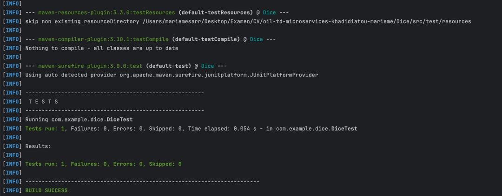
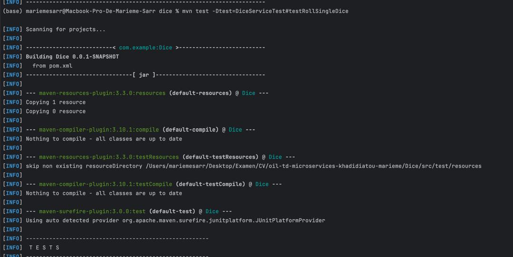
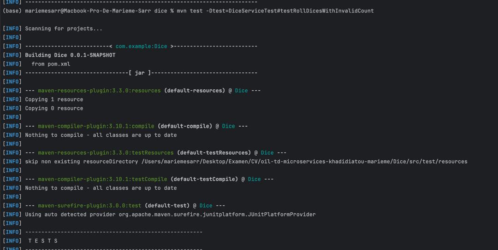
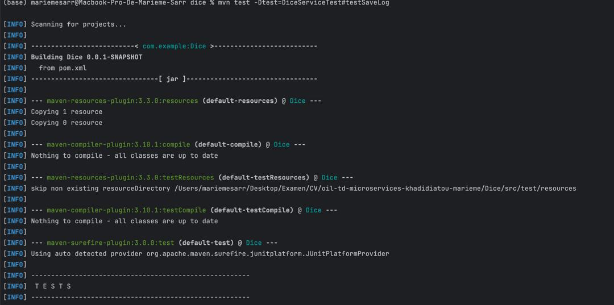
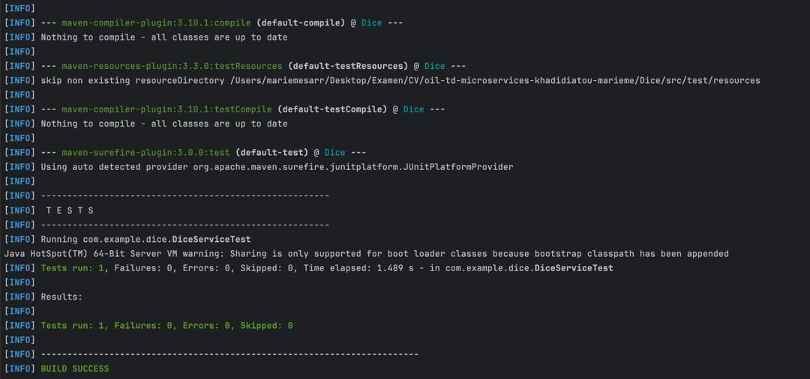
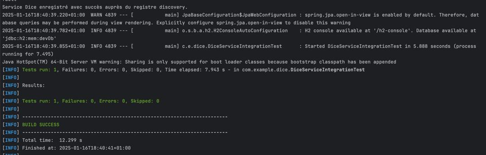
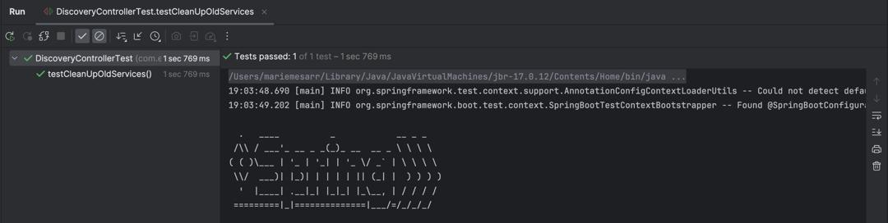
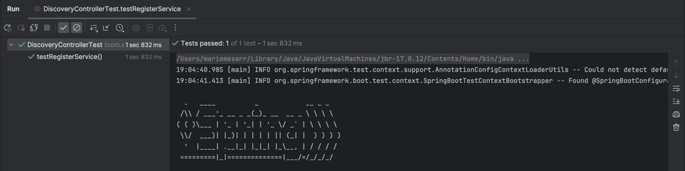
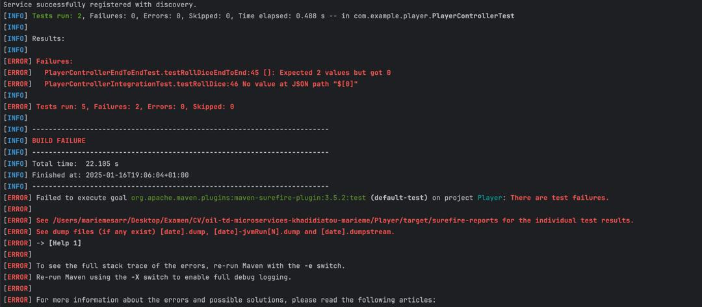

# Projet - Services Dice, Player, Discovery

Ce projet contient trois services :
- *Dice Service* : Gère le lancer de dés.
- *Player Service* : Gère les informations des joueurs.
- *Discovery Service* : Permet la découverte des services via un registre.

## Fonctionnement des Services

### Dice Service
- *Endpoints exposés* :
    - POST /roll : Lance un dé et retourne un résultat aléatoire.

- *Pour démarrer le service* :
    1. Allez au niveau des services, cliquez sur le service puis cliquez sur le bouton démarrer.

    2. Le service sera accessible à l'URL suivante : http://localhost:8081/.

- *Logs* :
    - Les logs du service afficheront des informations sur les lancés de dés, tels que les résultats.

### Player Service
- *Endpoints exposés* :
    - GET /players/{id} : Récupère les informations d'un joueur par son ID.
    - POST /players : Crée un nouveau joueur.

- *Pour démarrer le service* :
    1. Allez au niveau des services, cliquez sur le service puis cliquez sur le bouton démarrer.

    2. Le service sera accessible à l'URL suivante : http://localhost:8082/.

- *Logs* :
    - Les logs afficheront des informations concernant la création et la récupération des joueurs.

### Discovery Service
- *Endpoints exposés* :
    - GET /services : Liste tous les services enregistrés.
    - POST /register : Enregistre un service auprès du registre.

- *Pour démarrer le service* :
    1. Allez au niveau des services, cliquez sur le service puis cliquez sur le bouton démarrer.

    2. Le service sera accessible à l'URL suivante : http://localhost:8083/.

- *Logs* :
    - Les logs afficheront des informations sur l'enregistrement des services auprès du registre.

## Ordre de demarrage des services : 

1. Demarrer le Discovery Service 
2. Demarrer le Dice Service 
3. Demarrer le Player Service 

## Interaction Entre les Services

Chaque service s'enregistre auprès du *Discovery Service* pour être découvert par les autres services.

### Exemple d'interaction :
1. Le *Dice Service* envoie une requête POST pour s'enregistrer auprès du Discovery Service.
2. Le *Player Service* s'enregistre également auprès du Discovery Service.
3. Le *Discovery Service* permet aux autres services de découvrir les services enregistrés via son endpoint /services.

## Capture d'écran des logs

1. Le *Dice Service* 

2. Le *Player Service* 

3. Le *Discovery Service*

## Capture d'écran de l'enregistrement d'un service auprès du discovery

## Rapport de Test
### Liste des Tests
#### 1. *Test du Service de Dés (DiceServiceTest)*
- *Description* : Ce test vérifie que le service DiceService génère correctement des résultats de dés compris entre 1 et 6. Il simule des lancers de dés pour s'assurer que les valeurs générées respectent les règles du dé classique.

#### 2. *Test d'Intégration du Service de Dés (DiceServiceIntegrationTest)*
- *Description* : Ce test d'intégration vérifie que le service DiceService fonctionne correctement lorsqu'il est intégré avec d'autres composants de l'application. Il teste l'interaction du service avec le système dans son ensemble.

#### 3. *Test du Log des Lancers de Dés via l'API (DiceRollLogTest)*
- *Description* : Ce test vérifie que les lancers de dés sont correctement enregistrés dans un log via l'API. Il s'assure que les données de chaque lancer sont bien stockées et peuvent être récupérées.

#### 4. *Test du Contrôleur de Découverte (DiscoveryControllerTest)*
- *Description* : Ce test vérifie le bon fonctionnement du contrôleur de découverte de services. Il teste les points de terminaison pour enregistrer, récupérer et supprimer des services dans le cadre de l'API de découverte. Ce test permet d'assurer que l'enregistrement des services et la récupération des services enregistrés fonctionnent correctement.

#### 5. *Test du Service Player (PlayerServiceTest)*
- *Description* : Ce test vérifie que le service PlayerService gère correctement les joueurs. Il teste les fonctionnalités de création, de mise à jour et de suppression des joueurs, ainsi que la gestion de leurs scores et informations associées. Il s'assure que les actions effectuées sur les joueurs sont bien appliquées et que les données sont cohérentes.
#### 6. *Test d'Intégration du Service Player (PlayerServiceIntegrationTest)*
- *Description* : Ce test d'intégration s'assure que le service PlayerService fonctionne correctement dans le contexte de l'application, en interagissant avec la base de données ou d'autres services. Il vérifie que les opérations sur les joueurs sont effectuées correctement et que la persistance des données est bien respectée.
  
## Instructions pour Exécuter les Tests
- 1. Se positionner sur le dossier du service à tester
- 2. Executer la commande : mvn test
g

